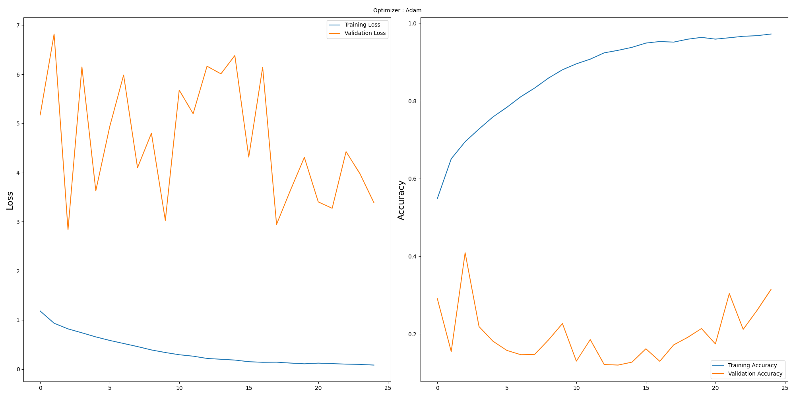

# Serena Emotion Detector

- [Serena Emotion Detector](#serena-emotion-detector)
  - [Background](#background)
  - [How to Train in Vertex AI](#how-to-train-in-vertex-ai)
    - [Model Training Behind the Scenes](#model-training-behind-the-scenes)
  - [How to Evaluate Model](#how-to-evaluate-model)
  - [Running Local Flask Server](#running-local-flask-server)
  - [Production Server](#production-server)
  - [Members Contributions](#members-contributions)

## Background

Serena Emotion Detector is a CNN model that detects 7 emotions (`angry`, `disgust`, `fear`, `happy`, `neutral`, `sad`, `surprise`) from a person's face photo.
For our implementation, we group those 7 emotions into 2 groups: energetic (which consists of `angry`, `fear`, `surprise`)
and relax (which consists of `disgust`, `happy`, `neutral`, `sad`) based on how they affect heart rate; energetic emotions increase heart rate while relax emotions decrease heart rate.
We use [FER2013](https://www.kaggle.com/deadskull7/fer2013) dataset since it is a popular dataset for emotion detection.

When we were starting with creating our model, we used to create the architecture from scratch. But after multiple trial and errors, the best we could get was around 64% accuracy. Even then, that took about 3 hours for every 10 epoch training session in Vertex AI. Other than that, our own models always faced problems where it would classify wrong emotions or would just be biassed towards one emotion class.

After learning from our mistakes, learning more about CNN, and learning from tutorials; we decided to use transfer learning. We used transfer learning since it would be quicker to train and we don't have to design the architecture from scratch, instead we would just need to modify the dataset and some layers to fit our needs of detecting 7 classes of emotions.

The model we use for transfer learning is [MobileNetV2](https://www.ict-srilanka.com/blog/what-is-mobilenetv2). We use MobileNetV2 since it is designed to be lightweight for devices with limited resources (e.g. mobile phones, IoT devices, etc). We think this would make predictions quicker when deployed on Cloud Run or later in the future when we want to embed it directly into our IoT device `SerenBox`.

We were able to get 94% accuracy with our model:



The graph above shows the movement of Loss and Accuracy from the train data and test data produced at each epoch. Based on this graph, the blue line shows the movement of the data train. Meanwhile, the red line shows movement for test data.

In the graph on the left, the loss value from the train data decreased until the 25th epoch and the loss value from the test data initially increased. During the iteration, the loss value for the test data fluctuated, but at the 25th epoch, it decreased.

The graph on the right shows that the accuracy value for the data train increases until the 25th epoch, which shows that the model that has been created is good. Meanwhile, the test data experienced fluctuations.

## How to Train in Vertex AI

Our notebook is configured to be trained in OUR Vertex AI environment. The training code is in [task.ipynb](training/trainer/task.ipynb) notebook. You need to adjust the code if you want to train it in your own Vertex AI environment. But, if you want to use the model directly, see the [How to Evaluate Model](#how-to-evaluate-model) section.

Here are the steps:

1. Clone this repository
2. Open terminal, CD into `/training` folder
3. Run `train.sh` in the terminal
4. Once it's finished, go to Vertex AI Training menu in GCP Console and click on "CUSTOM JOBS" tab
5. Your training job should be displayed as "serena-emotion-detector"
6. Click on it to view its details

### Model Training Behind the Scenes

We develop our model in the [task.ipynb](training/trainer/task.ipynb) notebook. We collaborate using Vertex AI user-managed notebook to get quick access to our cloud storage using the `/gcs` folder. Using `train.sh`, it's going to first call `setup.sh` which will package our code for training in Vertex AI. Then, it will use `gcloud` to submit a custom training job to Vertex AI. We store some models in Vertex AI Model Registry and also in cloud storage bucket.

## How to Evaluate Model

You can go load the [serena-emotion-detector.keras](deploy/model/serena-emotion-detector.keras) in the `/deploy/model` folder or use [evaluate.ipynb](training/trainer/evaluate.ipynb) inside of the `/training/trainer` folder. Open up the notebook and follow the steps there.

## Running Local Flask Server

The `/deploy` folder contains code to run Flask server that hosts this model. You can run it locally by:

1. CD into `/deploy` folder
2. Install dependencies through [requirements.txt](deploy/requirements.txt)
3. Run `python main.py` in the terminal
4. Test your local endpoint by running [test.sh](deploy/test.sh)

## Production Server

We use Cloud Build for CI/CD so that whenever we push to `main` branch, it's going to deploy on Cloud Run. The steps to deploy it are contained in [cloudbuild.yaml](deploy/cloudbuild.yaml) and [Dockerfile](deploy/Dockerfile).
You can use our public endpoint [https://serena-emotion-detector-2g6tjw7nja-et.a.run.app](https://serena-emotion-detector-2g6tjw7nja-et.a.run.app) through our [API Docs](https://serena-backend-2g6tjw7nja-et.a.run.app/api-docs/#/User%20Emotions/handleCallSerenaEmotionDetector) or by sending a POST request as described in [test.sh](deploy/test.sh):

```bash
curl -X POST -F "file=@$image" https://serena-emotion-detector-2g6tjw7nja-et.a.run.app
```

## Members Contributions

|              Name              |    Student ID    |                                                                                                                  Contribution                                                                                                                  |
|------------------------------|----------------|----------------------------------------------------------------------------------------------------------------------------------------------------------------------------------------------------------------------------------------------|
|      Nisrina Qurratu Aini      | (ML) M444BSX1534 | Collect datasets Preprocessing Data,   Create Models, Create Models with Transfer Learning,  Train Models,  Make models more accurate,  Create loss and accuracy graphs,  predict models,  Search for images for predict models, Documentation |
|       Akhmad Ikmal Zulfa       | (ML) M444BSY0588 | Split Data,  Preprocessing Data,  Analyze Data,  Create Models, Create Models with Transfer Learning,  Train Models,  Make models more accurate,  Create loss and accuracy graphs,  test models, predict models,  Documentation                |
| Muhammad Ahya Fajri Firmansyah | (ML) M444BSY1525 | Preprocessing Data,  Create Models, Create Models with Transfer Learning,  Train Models,  Make models more accurate,   predict models,  Search for images for predict models, Documentation                                                    |
| Muhammad Reyhan Ardiya Putra Wijaya | (CC) C200BSY3485 | Setup Vertex AI. Setup Cloud Storage to store dataset and model results. Create scripts to automate Vertex AI training. |
